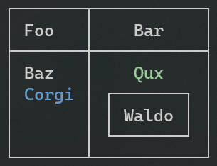

Title: Table
Order: 0
RedirectFrom: tables
Description: "Tables are a perfect way of displaying tabular data in a terminal. *Spectre.Console* is super smart about rendering tables and will adjust all columns to fit whatever is inside them."
Reference: T:Spectre.Console.Table
---

Tables are a perfect way of displaying tabular data in a terminal.

`Spectre.Console` is super smart about rendering tables and will adjust
all columns to fit whatever is inside them. Anything that implements 
`IRenderable` can be used as a column header or column cell, even another table!

<?# AsciiCast cast="table" /?>

## Usage

<!------------------------->
<!--- USAGE             --->
<!------------------------->

To render a table, create a `Table` instance, add the number of
columns that you need, and then add the rows. Finish by passing the
table to a console's `Render` method.

```csharp
// Create a table
var table = new Table();

// Add some columns
table.AddColumn("Foo");
table.AddColumn(new TableColumn("Bar").Centered());

// Add some rows
table.AddRow("Baz", "[green]Qux[/]");
table.AddRow(new Markup("[blue]Corgi[/]"), new Panel("Waldo"));

// Render the table to the console
AnsiConsole.Write(table);
```

This will render the following output:



## Table appearance

<!------------------------->
<!--- TABLE APPEARANCE  --->
<!------------------------->

### Borders

For a list of borders, see the [Borders](xref:borders) appendix section.

```csharp
// Sets the border
table.Border(TableBorder.None);
table.Border(TableBorder.Ascii);
table.Border(TableBorder.Square);
table.Border(TableBorder.Rounded);
```

### Expand / Collapse

```csharp
// Table will take up as much space as it can
// with respect to other things.
table.Expand();

// Table will take up minimal width
table.Collapse();
```

### Hide headers

```csharp
// Hides all column headers
table.HideHeaders();
```

### Set table width

```csharp
// Sets the table width to 50 cells
table.Width(50);
```

### Alignment

```csharp
table.Alignment(Justify.Right);
table.RightAligned();
table.Centered();
table.LeftAligned();
```

## Column appearance

<!------------------------->
<!--- COLUMN APPEARANCE --->
<!------------------------->

### Alignment

```csharp
table.Columns[0].Alignment(Justify.Right);
table.Columns[0].LeftAligned();
table.Columns[0].Centered();
table.Columns[0].RightAligned();
```

### Padding

```csharp
// Set padding individually
table.Columns[0].PadLeft(3);
table.Columns[0].PadRight(5);

// Or chained together
table.Columns[0].PadLeft(3).PadRight(5);

// Or with the shorthand method if the left and right 
// padding are identical. Vertical padding is ignored.
table.Columns[0].Padding(4, 0);
```

### Disable column wrapping

```csharp
// Disable column wrapping
table.Columns[0].NoWrap();
```

### Set column width

```csharp
// Set the column width
table.Columns[0].Width(15);
```

### Show row separators

```csharp
// Shows separator between each row
table.ShowRowSeparators();
```

## Sorting

You can sort table rows by a specific column using the `SortBy` method.
The sorting supports automatic type detection for strings, numbers (int, long, decimal), dates (DateTime, DateTimeOffset).

```csharp
// Sort by column name (ascending)
table.SortBy("Name");

// Sort by column name (descending)
table.SortBy("Age", descending: true);

// Or use the shorthand method
table.SortByDescending("Age");

// Sort by column index
table.SortBy(0);

// Clear any existing sorting
table.ClearSort();
```

### Sorting with custom comparer

For advanced sorting scenarios, you can provide a custom `IComparer<TableRow>`.

```csharp
// Custom sort using a comparer
table.SortBy(new CustomTableRowComparer());

public class CustomTableRowComparer : IComparer<TableRow>
{
    public int Compare(TableRow? x, TableRow? y)
    {
        // Custom comparison logic
        // Access cells via index: x?[0], y?[0]
        return 0;
    }
}
```

### Compatibility

Sorting is fully compatible with all existing table features:
- **Styles and Markup**: Styled cells (e.g., `[blue]Text[/]`) are sorted by their text content, ignoring markup tags
- **Alignment**: Column alignment (Left, Right, Center) is preserved after sorting
- **Headers and Footers**: Table headers and footers remain in their original positions; only data rows are sorted
- **Overflow and Truncation**: Cell overflow settings (Crop, Ellipsis, Fold) are unaffected by sorting